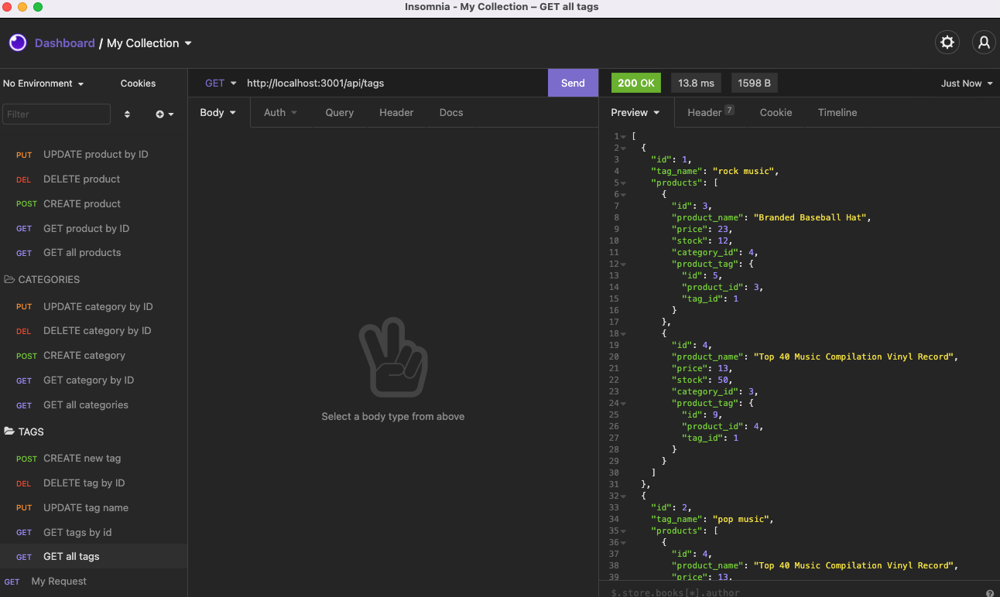

# e-commerce-back-end

## Description
This is the back-end for a hypothetical e-commerce site I created to practice principles of object-relational mapping while working with Express.js API routes, MYSQL databases, and Sequelize. It was also an opportunity to familiarize myself with the basic—very, very basic—structure of how a real e-commerce platform might operate.

[Here's a link to a video demo showing it in action](https://drive.google.com/file/d/1W-B1UOb4iF-UaeItA2nuSJv-DQpth1KF/view)

## Table of Contents

- [Installation](#installation)
- [Usage](#usage)
- [Credits](#credits)

## Installation

Download the code off of this GitHub repo. From the command line, run `npm install`. Install and save dotenv, express, mysql2, and sequelize as dependencies. (Double-check your package.json file.) Enter the correct information in the .env file: the database schema you'll be using is `ecommerce_db`. To run this locally, the user is `root`. Enter your MYSQL password after `DB_PW`. To create a database schema, open the MYSQL shell from your command line and enter `source db/schema.sql;`. Exit the MYSQL shell and seed the database with `node seeds/index.js` or `npm run seed`. Enter `npm start` to connect to the server.

## Usage

Because there's no front-end built, you'll want to test API routes and functionality using Insomnia or the API client or your choice, as seen in the image below.

The local server is set to PORT 3001, so you'll be querying this URL: `http:localhost:3001/api/` followed by the particular query parameters you'd like to test: either products, tags, or categories, or specific IDs following each. Have fun?

## Credits

The following links and documentation are just a sampling of the online resources that proved helpful as I was working on this: 

- https://javascript.info/async-await
- https://developer.mozilla.org/en-US/docs/Web/JavaScript/Reference/Statements/try...catch
- https://www.npmjs.com/package/dotenv
- https://sequelize.org/master/manual/model-instances.html#updating-an-instance
- https://stackoverflow.com/questions/46614290/sequelize-eager-loading-error
- https://stackoverflow.com/questions/50456128/unknown-column-in-field-list-sequelize
- https://sequelize.org/master/manual/model-querying-basics.html
- https://levelup.gitconnected.com/async-await-vs-promises-4fe98d11038f
- https://www.geeksforgeeks.org/difference-between-promise-and-async-await-in-node-js/
- https://www.youtube.com/watch?v=3qlnR9hK-lQ&ab_channel=Classsed
- https://www.youtube.com/watch?v=pxo7L5nd1gA&ab_channel=CoderOne